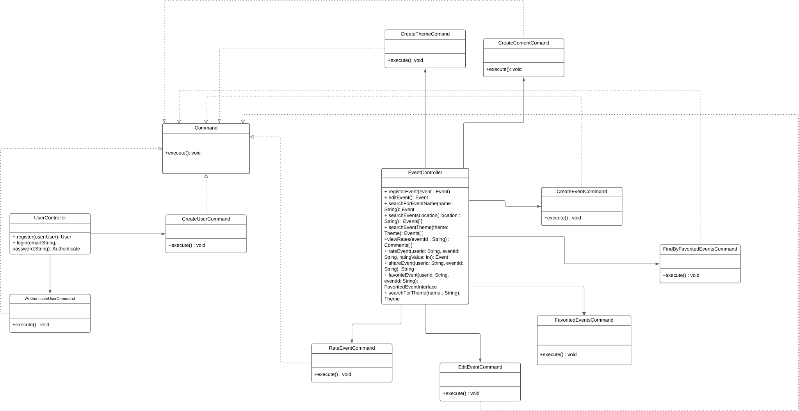

# 3.3.1.Command

## Introdução
O Padrão Command tem como definição encapsular uma solicitação como um objeto, o que lhe permite parametrizar outros objetos com diferentes solicitações, enfileirar ou registrar solicitações
e implementar recursos de cancelamento de operações. Isso inclui informações como o nome do método, o objeto que o método pertence e os valores dos parâmetros do método<a href="#ref1">[1]</a>.

## Metodologia

Para a elaboração deste documento, foram seguidas as seguintes etapas:

**Início do Projeto:** Primeiramente, foi realizado um estudo nos slides postados na plataforma Aprender, com o material disponibilizado pela professora <a href="#ref3">[2]</a>, como base para o entendimento do conceito do padrão de projeto comportamental Command. Também foi realizado estudos no livro Use a Cabeça: Padrões de Projeto<a href="#ref3">[3]</a>. 

**Busca por Ferramenta:** Após a conclusão dos estudos iniciais, iniciou-se a busca por uma plataforma adequada para ilustrar o padrão Command na forma de diagrama UML, com a finalidade de melhor representar o conceito de maneira visual e clara. A plataforma escolhida para isso foi o Lucidchart.

No projeto Backend estamos utilizando a tecnologia NestJS, então o código e estrutura será baseado nesse framework.

## Desenvolvimento

Figura 1 - Command.

Autor(es): [Ana Luíza Fernandes Alves da Rocha](AnaGH) e [Tales Rodrigues Gonçalves](TalesGH), 2025.

### Análise dos Resultados

A partir dos estudos realizados pela professora e das consultas feitas no livro Use a Cabeça: Padrões de Projeto, observamos a relevância e os benefícios do uso de padrões comportamentais como o Command. Esse padrão permite encapsular uma solicitação como um objeto, o que facilita a parametrização dos objetos com diferentes solicitações, o enfileiramento ou registro de pedidos e a execução de operações em momentos posteriores.

## Gravação da Reunião

Vídeo 1 - Gravação da reunião sobre o Command 

<iframe width="560" height="315" src="https://youtu.be/lae8DfEyxfs" title="YouTube video player" frameborder="0" allow="accelerometer; autoplay; clipboard-write; encrypted-media; gyroscope; picture-in-picture; web-share" referrerpolicy="strict-origin-when-cross-origin" allowfullscreen></iframe>

Participantes: [Ana Luíza Fernandes Alves da Rocha](AnaGH) e [Tales Rodrigues Gonçalves](TalesGH), 05 de jan. de 2024.

## Bibliografia

> 1. Command. Disponível em: [Command](https://pt.wikipedia.org/wiki/Command). Acesso em: 05 de jan. de 2024.
>
> 2.  SERRANO, Milene. AULA - GOFS COMPORTAMENTAIS. Slides. Universidade de Brasília, 2024. Acessado em: 05 de jan. de 2024.
>
> 3. Freeman, E., & Robson, E. Use a Cabeça: Padrões de Projeto. Acesso em: 05 de jan. de 2024.
>

## Histórico de Versões

| Versão  |    Data    | Descrição             | Autor(es)                                                                          | Revisor(es) | Detalhes da revisão |
|:-------:|:----------:|-----------------------|------------------------------------------------------------------------------------| ------ | :---: |
|  `1.0`  | 05/01/2025 | Criação do documento. | [Ana Luíza Fernandes Alves da Rocha](AnaGH) e [Tales Rodrigues Gonçalves](TalesGH) | [Ana Luíza Fernandes Alves da Rocha](AnaGH) |  Ajuste de ortografia e comentários. | 
|  `1.1`  | 05/01/2025 | Continuando documento | [Ana Luíza Fernandes Alves da Rocha](AnaGH) e [Tales Rodrigues Gonçalves](TalesGH) |  |  |

[AnaGH]: https://github.com/analufernanndess
[CainaGH]: https://github.com/freitasc
[ClaudioGH]: https://github.com/claudiohsc
[EliasGH]: https://github.com/EliasOliver21
[GuilhermeGH]: https://github.com/gmeister18
[JoelGH]: https://github.com/JoelSRangel
[KathlynGH]: https://github.com/klmurussi
[PabloGH]: https://github.com/pabloheika
[PedroRGH]: https://github.com/pedro-rodiguero
[PedroPGH]: https://github.com/Pedrin0030
[SamuelGH]: https://github.com/samuelalvess
[TalesGH]: https://github.com/TalesRG