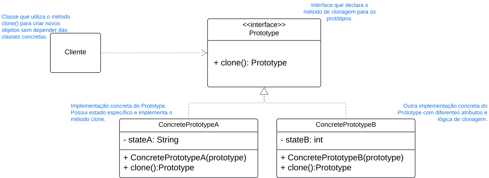

# 3.1.4. Prototype

## Introdução

Este documento tem como objetivo apresentar o **padrão de projeto Prototype**, pertencente à categoria dos padrões criacionais descritos no livro *"Design Patterns: Elements of Reusable Object-Oriented Software"*, de Erich Gamma, Richard Helm, Ralph Johnson e John Vlissides (conhecidos como Gang of Four, ou GoF) <a href="#ref1">[1]</a>.  

O **padrão Prototype** se refere a um método para criar objetos novos a partir da **cópia de uma instância existente**, conhecida como protótipo. Ele define uma interface comum para realizar a clonagem, permitindo que o cliente crie novos objetos sem depender de suas classes concretas <a href="#ref1">[1]</a> <a href="#ref2">[2]</a>.  

O **padrão Prototype** é de extrema importância para **evitar a dependência direta de classes concretas** e **otimizar a criação de objetos** quando o custo de instanciar novos objetos do zero é elevado. Isso é especialmente relevante em sistemas que exigem uma **duplicação de objetos complexos**, com hierarquias ou configurações iniciais caras <a href="#ref2">[2]</a>.  

Sendo assim, este documento tem como finalidade **explicar o conceito do padrão Prototype, descrever suas principais características, ilustrar suas aplicações práticas e apresentar diagramas UML** que facilitam a compreensão e a implementação deste padrão.  

## Metodologia
Para a elaboração deste documento, foram seguidas as seguintes etapas:

**Início do Projeto:** Primeiramente, foi realizado um estudo nos slides postados na plataforma Aprender, com o material disponibilizado pela professora <a href="#ref3">[3]</a>, como base para o entendimento do conceito do padrão de projeto Prototype.

**Busca por Ferramenta:** Após a conclusão dos estudos iniciais, iniciou-se a busca por uma plataforma adequada para ilustrar o padrão Prototype na forma de diagrama UML, com a finalidade de melhor representar o conceito de maneira visual e clara. A plataforma escolhida para isso foi o Lucidchart.

**Análise do Diagrama de Classe:** Em seguida, foi realizada uma análise no diagrama de classes do projeto. Durante a análise, foi observado que não havia classes que pudessem ser aplicadas ao conceito do padrão Prototype <a href="#ref5">[5]</a>. Esse ponto foi crucial para a decisão de criar um artefato explicativo.

**Desenvolvimento do Artefato:** Como resultado, foi desenvolvido um artefato explicativo utilizando o Lucidchart, com o objetivo de demonstrar o funcionamento do padrão Prototype e suas aplicabilidades, dado que o diagrama de classes do projeto não contemplava diretamente o uso deste padrão.

## Desenvolvimento

Figura 1 - imagem.

Autor(es): [Pedro Paulo](PedroPGH), 2024.

Durante a análise do projeto, foi identificado que não existiam classes adequadas para a aplicação direta do padrão Prototype. Assim, o artefato explicativo foi elaborado para cumprir os seguintes propósitos:

- Educar e Demonstrar: Explicar de maneira visual como o padrão Prototype pode ser implementado e suas vantagens.
- Preparar o Projeto: Servir como base para uma futura aplicação do padrão, caso o projeto evolua para incluir cenários compatíveis.

### Análise dos Resultados 
#### Principais achados
Os resultados obtidos confirmam que o padrão de projeto Prototype é uma abordagem útil para situações em que a criação de objetos pode ser simplificada por meio da clonagem de instâncias existentes. O diagrama elaborado foi eficaz ao representar a estrutura do padrão, destacando como ele pode ser aplicado para reduzir a dependência de classes concretas e otimizar a criação de objetos.
#### Limitações
- Não foi possível implementar o padrão Prototype no projeto atual, pois ele não possui classes que justifiquem sua aplicação no momento.
- O uso desse padrão deve ser avaliado com cautela para evitar introduzir complexidade desnecessária, especialmente em projetos menores ou com requisitos mais simples.

## Bibliografia

> 1. Gamma, E., Helm, R., Johnson, R., & Vlissides, J. *Design Patterns: Elements of Reusable Object-Oriented Software*. Disponível em: [https://link.com](https://link.com). Acesso em: 13 de dez. de 2024.  
>
> 2. Freeman, E., Robson, E., Bates, B., & Sierra, K. *Head First Design Patterns*. Disponível em: [https://link.com](https://link.com). Acesso em: 13 de dez. de 2024.  
>
> 3.  SERRANO, Milene. AULA - GOFS CRIACIONAIS. Slides. Universidade de Brasília, 2024. Acessado em: 10 de dez. de 2024.
>
> 4. Diagramas UML. Disponível em: https://miro.com/pt/diagrama/o-que-e-uml/. Acesso em: 14 de dez. de 2024.
>
> 5.  Prototype. Disponível em: [https://refactoring.guru/pt-br/design-patterns/prototype](https://refactoring.guru/pt-br/design-patterns/prototype). Acesso em: 14 de dez. de 2024.
>
> 6.  Prototype Teoria - Padrões de Projeto - Parte 8/45. Disponível em: https://www.youtube.com/watch?v=Z-_smcjkdwM&t=508s. Acesso em: 10 ded dez. de 2024.

## Histórico de Versões

| Versão |    Data     | Descrição             | Autor(es) | Revisor(es)                                  |      Detalhes da revisão      |
|:------:|:-----------:|-----------------------| ----------- |----------------------------------------------|:-----------------------------:|
| `1.0`  | 15/12/2024  | Criação do documento. | [Pedro Paulo](PedroPGH)  | [Ana Luíza Fernandes Alves da Rocha] [AnaGH] | Revisando código do prototype | 
| `1.1`  | 16/12/2024  | Código ajustado.      |[Ana Luíza Fernandes Alves da Rocha] [AnaGH] |  [Kathlyn Murussi][KathlynGH] | Foi pedido análise dos resultados do documento. |    
| `1.2`  | 05/01/2025  | Retirando código e justificando o motivo de não ser implementado.|[Ana Luíza Fernandes Alves da Rocha] [AnaGH] | [Kathlyn Murussi][KathlynGH] | Nenhuma alteração a ser feita. |  

[AnaGH]: https://github.com/analufernanndess
[CainaGH]: https://github.com/freitasc
[ClaudioGH]: https://github.com/claudiohsc
[EliasGH]: https://github.com/EliasOliver21
[GuilhermeGH]: https://github.com/gmeister18
[JoelGH]: https://github.com/JoelSRangel
[KathlynGH]: https://github.com/klmurussi
[PabloGH]: https://github.com/pabloheika
[PedroRGH]: https://github.com/pedro-rodiguero
[PedroPGH]: https://github.com/Pedrin0030
[SamuelGH]: https://github.com/samuelalvess
[TalesGH]: https://github.com/TalesRG
