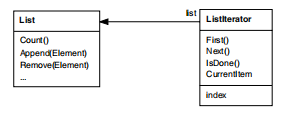
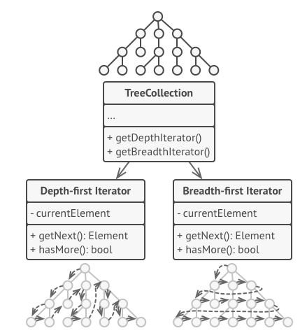
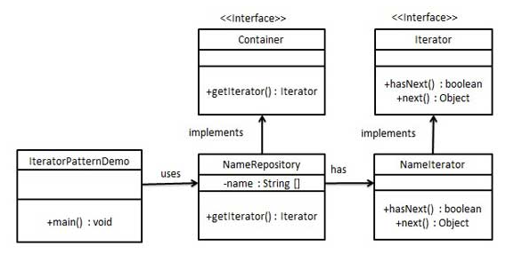

# 3.3.2.Iterator
<!--
    Lembrete de que isso é só um template. Apenas um guia para ajudar a lembrar de pontos importantes.
    Sinta-se livre para adicionar ou remover seções conforme a necessidade do documento. :)
-->

## Introdução
<!--
    A introdução deve apresentar o documento de forma clara e objetiva, fornecendo uma visão geral do conteúdo que será abordado.
    
    Perguntas a serem respondidas:

Este documento tem como objetivo apresentar o [tema ou objetivo].
O [tema ou objetivo] se refere a [definição ou descrição breve] [Nº Referência].
O [tema ou objetivo] é de extrema importância para [motivo], pois [justificativa].
Sendo assim, este documento tem como finalidade [objetivo do documento].
-->

Também conhecido como *Cursor*, o **Iterator** é um padrão de [projeto comportamental](PadroesDeProjeto/3.3.GoFsComportamentais) que delega a um objeto Iterator a responsabilidade de abstrair a complexidade da estrutura interna de uma coleção <sub>[2](#ref2)</sub>. Ele permite acessar e percorrer os elementos de maneira sequencial, independentemente de como a coleção está implementada.

O padrão Iterator é utilizado para: <sub>[1](#ref1)</sub>

- Acessar os elementos de uma coleção sem expor sua representação interna (seja uma lista, árvore, ou outra estrutura de dados), como mostrado na Figura 1.

<font size="2"><p style="text-align: center">Figura 1 - Iterator ListInterator pecorrendo a List.</p></font>

<center>



</center>

<font size="2"><p style="text-align: center">Fonte: Gamma, E.; Helm, R.; Johnson, R.; Vlissides, J. GAMMA, E.; HELM, R.; JOHNSON, R.; VLISSIDES, J. Padrões de projeto: soluções reutilizáveis de software orientado a objetos [recurso eletrônico]. Tradução Luiz A. Meirelles Salgado. Porto Alegre: Bookman, 2007.</p></font>

- Suportar múltiplos percursos em objetos agregados (como busca em largura ou profundidade), como mostrado na Figura 2.

<font size="2"><p style="text-align: center">Figura 2 - Iterators implementando múltiplos percursos em uma árvore.</p></font>

<center>



</center>

<font size="2"><p style="text-align: center">Fonte: Iterator. Refactoring.Guru. Disponível em: [https://refactoring.guru/pt-br/design-patterns/iterator](https://refactoring.guru/pt-br/design-patterns/iterator). Acesso em: 06 de jan. de 2025.</p></font>

- Fornecer uma interface uniforme para percorrer diferentes estruturas de agregação, possibilitando a iteração polimórfica.

Para implementar o Iterator, usaremos a figura 3 de exemplo para mostrar os passos:

<font size="2"><p style="text-align: center">Figura 3 - IteratorPatternDemo, uma demonstração da implementação do padrão iterator.</p></font>

<center>



</center>

<font size="2"><p style="text-align: center">Fonte: Design Patterns - Iterator Pattern. tutorialspoint. Disponível em: [https://www.tutorialspoint.com/design_pattern/iterator_pattern.htm](https://www.tutorialspoint.com/design_pattern/iterator_pattern.htm). Acesso em: 06 de jan. de 2025.</p></font>

Os passos com códigos, implementando o iterator em java, foram retirados do [tutorialspoint](https://www.tutorialspoint.com/design_pattern/iterator_pattern.htm).

1. Declarar interfaces.

Iterator.java

```java
public interface Iterator {
   public boolean hasNext();
   public Object next();
}
```

Container.java

```java
public interface Container {
   public Iterator getIterator();
}
```

2. Criar as classes concreta implementando a interface Container.

NameRepository.java
``` java
public class NameRepository implements Container {
   public String names[] = {"Robert" , "John" ,"Julie" , "Lora"};

   @Override
   public Iterator getIterator() {
      return new NameIterator();
   }

   private class NameIterator implements Iterator {

      int index;

      @Override
      public boolean hasNext() {
      
         if(index < names.length){
            return true;
         }
         return false;
      }

      @Override
      public Object next() {
      
         if(this.hasNext()){
            return names[index++];
         }
         return null;
      }		
   }
}
```

3. Use o NameRepository para obter nomes de iteradores.

IteratorPatternDemo.java
```java
public class IteratorPatternDemo {
	
   public static void main(String[] args) {
      NameRepository namesRepository = new NameRepository();

      for(Iterator iter = namesRepository.getIterator(); iter.hasNext();){
         String name = (String)iter.next();
         System.out.println("Name : " + name);
      } 	
   }
}
```
4. Verificar a saída.

## Metodologia
<!--
    A metodologia deve descrever o processo de elaboração do documento, apresentando as etapas e ferramentas utilizadas para a sua construção.
    
    Perguntas a serem respondidas:

Para a elaboração deste documento, foram seguidas as seguintes etapas:
- Inicialmente, foi realizada uma reunião com os membros da equipe do projeto [X] para discutir e alinhar as principais questões relacionadas a [tema ou objetivo].
- Pesquisas foram conduzidas em [A](#ref1) e [B](#ref2), proporcionando uma base sólida para a análise e discussão.
    - Se possível, adicionar algum algum documento nosso. (Caso haja elo com outro documento)
- O desenvolvimento do projeto seguiu a metodologia [C](#ref3), garantindo a aplicabilidade das melhores práticas no processo.
- Utilizou-se a ferramenta [Z](#ref4) para a parte [L] do projeto, a fim de [justificativa].

A metodologia [C] adotada pode ser visualizada de forma detalhada através dos seguintes passos [listar, tabela, imagens, ou vídeos, conforme necessário].
-->

Inicialmente, a elaboração deste documento foi precedida por uma reunião com a equipe do projeto EvenTour, com o objetivo de alinhar as principais diretrizes de desenvolvimento. Nessa reunião, ficou estabelecido que as demandas seriam divididas entre duplas, com cada membro responsável pela implementação de um a dois padrões de projeto comportamentais, conforme a disponibilidade, considerando o cronograma apertado e a proximidade do recesso de fim de ano.

Para embasar o trabalho, foram realizadas inicialmente pesquisas utilizando os conteúdos disponibilizados na página da disciplina no Aprender3<sub>[3](#ref)</sub> e o site Refactoring.Guru<sub>[2](#ref)</sub>, o que proporcionou uma base teórica sólida para análise e discussão.

A produção deste documento envolveu uma videochamada (gravada) no Microsoft Teams, dedicada à discussão de ideias e potenciais aplicações do padrão Iterator no projeto. E posteriormente a elaboração deste artefato

As seguintes ferramentas foram empregadas no desenvolvimento do projeto:

- Microsoft Teams: Plataforma utilizada para as reuniões da equipe.
- Visual Studio Code com Live Share: Ambiente de desenvolvimento integrado utilizado para a programação em pares.
- Docsify: Gerador de documentação estática utilizado para a documentação do projeto.
- Telegram: Aplicativo de mensagens utilizado para comunicação assíncrona entre os membros da equipe.
- Issues do GitHub com Zenhub: Sistema de gerenciamento de projetos utilizado para o acompanhamento do progresso e organização das tarefas.
- YouTube: Plataforma utilizada para disponibilizar as gravações das atividades e discussões do projeto.

## Análise dos Resultados <!-- NÃO apague essa sub -->
<!-- 
    Utilize este espaço para destacar os principais achados, interpretar os dados e identificar implicações ou limitações dos resultados obtidos. Adicione observações objetivas e mantenha o foco na relevância dos resultados para o projeto. 
-->
Com base nos estudos da professora, consultas à página da disciplina e à documentação do Refactoring Guru, reconhecemos a importância e os benefícios dos padrões de projeto organizacionais, como o Iterator, para o desenvolvimento de software, especialmente no aumento da eficiência.

Contudo, o projeto EvenTour não emprega estruturas de dados como listas, pilhas ou árvores. Essa característica intrínseca do projeto inviabiliza a aplicação do padrão Iterator, impossibilitando sua adaptação para fins acadêmicos neste contexto específico.

## Gravação da Reunião 
<!--
    Apague essa seção se não tiver gravação(s) da reunião. Mas tenha em mente que é uma boa prática gravar as reuniões para futuras consultas.
-->

<font size="2"><p style="text-align: center">Vídeo 1 - Gravação da reunião 1 sobre o Iterator </p></font>

<iframe width="560" height="315" 
  src="https://www.youtube.com/embed/Dvd-KawoYWs" 
  frameborder="0" 
  allow="accelerometer; autoplay; clipboard-write; encrypted-media; gyroscope; picture-in-picture" 
  allowfullscreen>
</iframe>

<font size="2"><p style="text-align: center">Participantes: [Kathlyn Murussi][KathlynGH] & [Pablo S. Costa][PabloGH], 06 de jan. de 2025.</p></font>

## Bibliografia

> 1. <a id="ref1"></a>Gamma, E.; Helm, R.; Johnson, R.; Vlissides, J. GAMMA, E.; HELM, R.; JOHNSON, R.; VLISSIDES, J. Padrões de projeto: soluções reutilizáveis de software orientado a objetos [recurso eletrônico]. Tradução Luiz A. Meirelles Salgado. Porto Alegre: Bookman, 2007.
>
> 2. <a id="ref2"></a>Iterator. Refactoring.Guru. Disponível em: [https://refactoring.guru/pt-br/design-patterns/iterator](https://refactoring.guru/pt-br/design-patterns/iterator). Acesso em: 06 de jan. de 2025.
>
> 3. <a id="ref3"></a> SERRANO, Milene. AULA - GOFS COMPORTAMENTAIS. Slides. Universidade de Brasília, 2024. Acessado em: 06 de jan. de 2025.
>
> 4. <a id="ref4"></a>Guia rápido de consultas no MongoDb. Disponível em: [https://cwi.com.br/blog/guia-rapido-de-consultas-no-mongodb/](https://cwi.com.br/blog/guia-rapido-de-consultas-no-mongodb/). Acesso em: 06 de jan. de 2025.
>
> 5. <a id="ref5"></a>Design Patterns - Iterator Pattern. tutorialspoint. Disponível em: [https://www.tutorialspoint.com/design_pattern/iterator_pattern.htm](https://www.tutorialspoint.com/design_pattern/iterator_pattern.htm). Acesso em: 06 de jan. de 2025.

## Histórico de Versões

| Versão | Data | Descrição | Autor(es) | Revisor(es) | Detalhes da revisão |
| :----: | :--: | --------- | ----------- | ------ | :---: |
| `1.0`  | 06/01/2025 | Criação do documento. | [Kathlyn Murussi](KathlynGH) & [Pablo S. Costa][PabloGH] |  |  | 

[AnaGH]: https://github.com/analufernanndess
[CainaGH]: https://github.com/freitasc
[ClaudioGH]: https://github.com/claudiohsc
[EliasGH]: https://github.com/EliasOliver21
[GuilhermeGH]: https://github.com/gmeister18
[JoelGH]: https://github.com/JoelSRangel
[KathlynGH]: https://github.com/klmurussi
[PabloGH]: https://github.com/pabloheika
[PedroRGH]: https://github.com/pedro-rodiguero
[PedroPGH]: https://github.com/Pedrin0030
[SamuelGH]: https://github.com/samuelalvess
[TalesGH]: https://github.com/TalesRG
