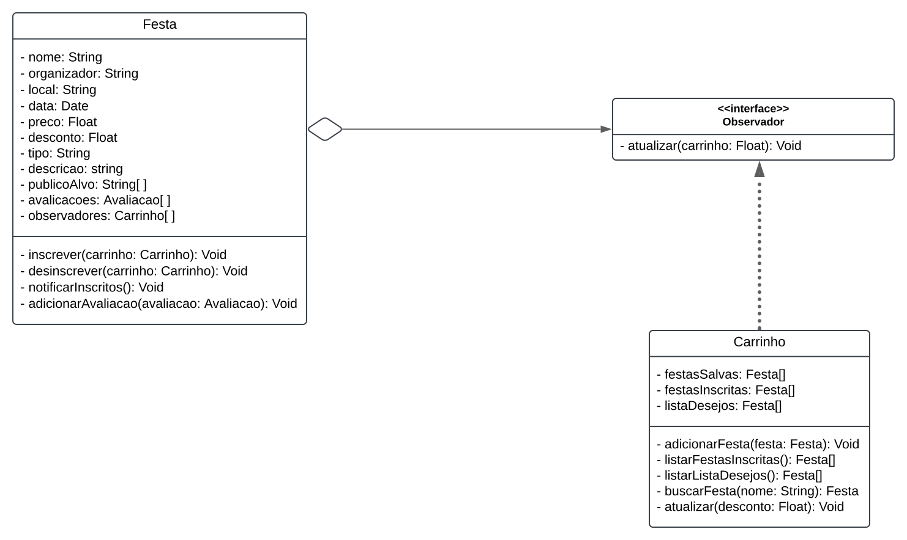

# 3.3.4.Observer 
<!--
    Lembrete de que isso é só um template. Apenas um guia para ajudar a lembrar de pontos importantes.
    Sinta-se livre para adicionar ou remover seções conforme a necessidade do documento. :)
-->

## Introdução

O padrão de projeto Observer, define uma relação um-para-muitos entre objetos. Ele permite que quando o estado de um objeto (chamado de Subject) muda, todos os seus dependentes (denominados Observers) sejam notificados e atualizados automaticamente. Este padrão é amplamente utilizado em sistemas que dependem de eventos ou reatividade, como interfaces gráficas e frameworks modernos.<sup><a href="">1</a></sup>

O objetivo principal do Observer é promover o desacoplamento entre os objetos que geram dados e aqueles que consomem esses dados, aumentando a flexibilidade do sistema.

## Metodologia

Para implementarmos o padrão Observer em nosso projeto, inicialmente realizamos a modelagem estrutural do padrão utilizando o [Draw.io](https://app.diagrams.net/). Em um primeiro momento, os autores deste artefato realizaram uma reunião inicial não gravada para discutir a aplicação do padrão Observer, definindo onde ele seria utilizado no projeto.

A justificativa para a escolha dessas classes está no comportamento esperado delas. Por exemplo, a classe Sistema de Notificações precisa informar aos usuários alterações em eventos de forma automática, enquanto a classe Agenda deve refletir mudanças em horários ou disponibilidade de serviços. Para implementar o padrão, foi criada uma classe Subject para gerenciar os observadores e garantir que os dados fossem atualizados automaticamente, e as classes que atuam como Observers foram projetadas para reagir às notificações de maneira específica ao contexto.

Essa abordagem garantiu um sistema mais dinâmico e com menor acoplamento, proporcionando flexibilidade na evolução do projeto e facilidade na manutenção.

## Desenvolvimento

Abaixo, nas figuras 1 e 2, temos a modelagem descrevendo a utilização do padrão Builder para a criação de objetos do tipo Evento e Usuário, respectivamente em nosso projeto. No diagrama temos a classe Director que possui dois métodos o constructBasicEvent e o constructFullEvent, que respectivamente criam um evento com os atributos essenciais ou com todos os atributos possíveis, e as classes para a criação do objeto do tipo Usuário seguem a mesma lógica de construção e fluxo de execução apresentadas do tipo Event. Temos a interface EventBuilderInterface que possui as assinaturas de todos os métodos para a criação de um evento, já para a instanciação dos objetos temos a classe EventBuilder que importa a interface com os métodos já ditos. Por fim temos a classe Event que é a classe concreta base que contém os atributos de um evento e que é importada pela EventBuilder. A classe de Usuário segue o mesmo padrão dessas quatro classes padrões que utilizamos (InterfaceBuider, Builder, Principal e a Director).

<font size="2"><p style="text-align: center">Figura 1 -  Diagrama Observer.</p></font>

<center>



</center>

<font size="2"><p style="text-align: center">Autor(es): [Guilherme Meister][GuilhermeGH], 2024.</p></font>

### Código

```ts

// Interface ObservadorDesconto
class ObservadorDesconto {
    atualizar(festa, novoPreco) {
        throw new Error("Este método deve ser implementado.");
    }
}

// Classe Festa
class Festa {
    constructor(nome, organizador, preco, data, local, descricao, publicoAlvo) {
        this.nome = nome;
        this.organizador = organizador;
        this.preco = preco;
        this.data = data;
        this.local = local;
        this.descricao = descricao;
        this.publicoAlvo = publicoAlvo;
        this.observadores = [];
    }

    observar(observador) {
        if (observador instanceof ObservadorDesconto) {
            this.observadores.push(observador);
        } else {
            throw new Error("Observador deve implementar a interface ObservadorDesconto.");
        }
    }

    pararDeObservar(observador) {
        this.observadores = this.observadores.filter(obs => obs !== observador);
    }

    notificarObservadores() {
        this.observadores.forEach(observador =>
            observador.atualizar(this, this.preco)
        );
    }

    setDesconto(percentualDesconto) {
        const novoPreco = this.preco - (this.preco * (percentualDesconto / 100));
        this.preco = novoPreco;
        this.notificarObservadores();
    }
}

// Classe Cliente
class Cliente extends ObservadorDesconto {
    constructor(nome, email, nomeExibicao) {
        super();
        this.nome = nome;
        this.email = email;
        this.nomeExibicao = nomeExibicao;
        this.listaDesejos = [];
    }

    atualizar(festa, novoPreco) {
        console.log(`Cliente ${this.nomeExibicao} foi notificado sobre um desconto na festa ${festa.nome}. Novo preço: R$${novoPreco.toFixed(2)}`);
    }

    adicionarAListaDesejos(festa) {
        this.listaDesejos.push(festa);
        festa.observar(this);
    }

    removerDaListaDesejos(festa) {
        this.listaDesejos = this.listaDesejos.filter(f => f !== festa);
        festa.pararDeObservar(this);
    }
}

// Teste do sistema
try {
    // Criação de festas
    const festaJunina = new Festa(
        "Festa Junina",
        "Associação Junina",
        50.00,
        "2024-06-20",
        "Praça Central",
        "Uma festa típica com comidas e danças tradicionais.",
        ["Famílias", "Crianças"]
    );

    const carnaval = new Festa(
        "Carnaval de Rua",
        "Bloco Folia",
        150.00,
        "2024-02-15",
        "Centro da Cidade",
        "Desfile de blocos e fantasias.",
        ["Adultos", "Adolescentes"]
    );

    // Criação de clientes
    const cliente1 = new Cliente("João Silva", "joao@example.com", "João");
    const cliente2 = new Cliente("Maria Oliveira", "maria@example.com", "Maria");

    // Adicionando festas à lista de desejos
    cliente1.adicionarAListaDesejos(festaJunina);
    cliente2.adicionarAListaDesejos(carnaval);

    // Aplicando desconto nas festas
    console.log(`Preço atual da festa: R$${festaJunina.preco.toFixed(2)}`);
    festaJunina.setDesconto(20); // Aplica 20% de desconto
    console.log(`Preço atual da festa: R$${festaJunina.preco.toFixed(2)}`);

    console.log(`Preço atual da festa: R$${carnaval.preco.toFixed(2)}`);
    carnaval.setDesconto(10); // Aplica 10% de desconto
    console.log(`Preço atual da festa: R$${carnaval.preco.toFixed(2)}`);

    // Removendo clientes das notificações
    cliente1.removerDaListaDesejos(festaJunina);
} catch (error) {
    console.error(error.message);
}

```

```ts
Preço atual da festa: R$50.00
Cliente João foi notificado sobre um desconto na festa Festa Junina. Novo preço: R$40.00
Preço atual da festa: R$40.00
Preço atual da festa: R$150.00
Cliente Maria foi notificado sobre um desconto na festa Carnaval de Rua. Novo preço: R$135.00
Preço atual da festa: R$135.00
```


### Análise dos Resultados <!-- NÃO apague essa sub -->
<!-- 
    Utilize este espaço para destacar os principais achados, interpretar os dados e identificar implicações ou limitações dos resultados obtidos. Adicione observações objetivas e mantenha o foco na relevância dos resultados para o projeto. 
-->

## Gravação da Reunião 
<!--
    Apague essa seção se não tiver gravação(s) da reunião. Mas tenha em mente que é uma boa prática gravar as reuniões para futuras consultas.
-->

<font size="2"><p style="text-align: center">Vídeo 1 - Gravação da reunião X sobre Y </p></font>

<iframe width="560" height="315" 
  src="https://www.youtube.com/embed/codigo" 
  frameborder="0" 
  allow="accelerometer; autoplay; clipboard-write; encrypted-media; gyroscope; picture-in-picture" 
  allowfullscreen>
</iframe>

<font size="2"><p style="text-align: center">Participantes: [Ciclano](CiclanoGH), [Fulano](FulanoGH) e [Beltrano](BeltranoGH), 11 de dez. de 2024.</p></font>

## Bibliografia

> 1. <a id="ref1"></a>Titulo da fonte. Disponível em: [https://link.com](https://link.com). Acesso em: 01 de jan. de 2001.
>
> 2. <a id="ref2"></a>Titulo da fonte. Disponível em: [https://link.com](https://link.com). Acesso em: 01 de jan. de 2001.
>
> 3. <a id="ref3"></a>Titulo da fonte. Disponível em: [https://link.com](https://link.com). Acesso em: 01 de jan. de 2001.
>
> 4. <a id="ref4"></a>Titulo da fonte. Disponível em: [https://link.com](https://link.com). Acesso em: 01 de jan. de 2001.
>

## Histórico de Versões

| Versão | Data | Descrição | Autor(es) | Revisor(es) | Detalhes da revisão |
| :----: | :--: | --------- | ----------- | ------ | :---: |
| `1.0`  | 01/01/2001 | Criação do documento. | [Ciclano](CiclanoGH)  |  |  | 

[AnaGH]: https://github.com/analufernanndess
[CainaGH]: https://github.com/freitasc
[ClaudioGH]: https://github.com/claudiohsc
[EliasGH]: https://github.com/EliasOliver21
[GuilhermeGH]: https://github.com/gmeister18
[JoelGH]: https://github.com/JoelSRangel
[KathlynGH]: https://github.com/klmurussi
[PabloGH]: https://github.com/pabloheika
[PedroRGH]: https://github.com/pedro-rodiguero
[PedroPGH]: https://github.com/Pedrin0030
[SamuelGH]: https://github.com/samuelalvess
[TalesGH]: https://github.com/TalesRG