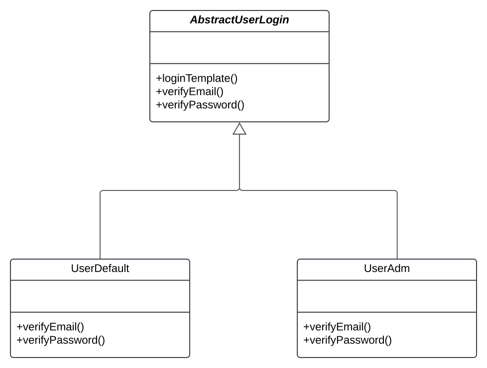

# 3.3.7.Template Method

## Introdução
O Template Method é um padrão de projeto comportamental que define o esqueleto de um algoritmo na superclasse mas deixa as subclasses sobrescreverem etapas específicas do algoritmo sem modificar sua estrutura. 
Ele sugere que você quebre um algoritmo em uma série de etapas, transforme essas etapas em métodos, e coloque uma série de chamadas para esses métodos dentro de um único método padrão. 
As etapas podem ser tanto abstratas, ou ter alguma implementação padrão. Para usar o algoritmo, o cliente deve fornecer sua própria subclasse, implementar todas as etapas abstratas, 
e sobrescrever algumas das opcionais se necessário (mas não o próprio método padrão)<a href="#ref3">[1]</a>.

## Metodologia

Para a elaboração deste documento, foram seguidas as seguintes etapas:

**Início do Projeto:** Primeiramente, foi realizado um estudo nos slides postados na plataforma Aprender, com o material disponibilizado pela professora <a href="#ref3">[2]</a>, como base para o entendimento do conceito do padrão de projeto comportamental Template Method. Também foi realizado estudos no livro Use a Cabeça: Padrões de Projeto<a href="#ref3">[3]</a>.

**Busca por Ferramenta:** Após a conclusão dos estudos iniciais, iniciou-se a busca por uma plataforma adequada para ilustrar o padrão Template Method na forma de diagrama UML, com a finalidade de melhor representar o conceito de maneira visual e clara. A plataforma escolhida para isso foi o Lucidchart.

**Análise do Diagrama de Classe:** Em seguida, foi realizada uma análise no diagrama de classes do projeto. Durante a análise, foi observado que não havia classes que pudessem ser aplicadas ao conceito do Template Method. Esse ponto foi crucial para a decisão de criar um artefato explicativo.

## Desenvolvimento

Figura 1 - Template Method.

Autor(es): [Ana Luíza Fernandes Alves da Rocha](AnaGH) e [Tales Rodrigues Gonçalves](TalesGH), 2025.

### Análise dos Resultados
#### Principais achados
É uma solução bastante útil em cenários onde um conjunto de operações possui uma estrutura fixa, mas com algumas variações que precisam ser personalizadas nas subclasses. 
O diagrama elaborado foi eficiente para ilustrar esse conceito e como ele poderia ser aplicado em uma situação futura, permitindo que as subclasses ajustem apenas as partes variáveis do processo, 
enquanto a estrutura geral do algoritmo permanece inalterada. Essa abordagem facilita a reutilização de código e contribui para uma organização mais eficiente do sistema.

#### Limitações
- Não foi possível implementar o padrão Template Method no projeto atual, pois não há classes ou fluxos de trabalho que exijam uma estrutura de algoritmo fixa com variações nas etapas.

## Gravação da Reunião

Vídeo 1 - Gravação da reunião sobre o Template Method 

<iframe width="560" height="315" src="https://youtu.be/uGZ95okAD3s" title="YouTube video player" frameborder="0" allow="accelerometer; autoplay; clipboard-write; encrypted-media; gyroscope; picture-in-picture; web-share" referrerpolicy="strict-origin-when-cross-origin" allowfullscreen></iframe>

Participantes: [Ana Luíza Fernandes Alves da Rocha](AnaGH) e [Tales Rodrigues Gonçalves](TalesGH), 05 de jan. de 2024.

## Bibliografia

> 1. Template Method. Disponível em: [Template Method](https://refactoring.guru/pt-br/design-patterns/template-method). Acesso em: 05 de jan. de 2024.
>
> 2.  SERRANO, Milene. AULA - GOFS COMPORTAMENTAIS. Slides. Universidade de Brasília, 2024. Acessado em: 05 de jan. de 2024.
>
> 3. Freeman, E., & Robson, E. Use a Cabeça: Padrões de Projeto. Acesso em: 05 de jan. de 2024.
>

## Histórico de Versões

| Versão  |    Data    | Descrição             | Autor(es)                                                                          | Revisor(es) | Detalhes da revisão |
|:-------:|:----------:|-----------------------|------------------------------------------------------------------------------------| ------ | :---: |
|  `1.0`  | 05/01/2025 | Criação do documento. | [Ana Luíza Fernandes Alves da Rocha](AnaGH) e [Tales Rodrigues Gonçalves](TalesGH) | |  | 

[AnaGH]: https://github.com/analufernanndess
[CainaGH]: https://github.com/freitasc
[ClaudioGH]: https://github.com/claudiohsc
[EliasGH]: https://github.com/EliasOliver21
[GuilhermeGH]: https://github.com/gmeister18
[JoelGH]: https://github.com/JoelSRangel
[KathlynGH]: https://github.com/klmurussi
[PabloGH]: https://github.com/pabloheika
[PedroRGH]: https://github.com/pedro-rodiguero
[PedroPGH]: https://github.com/Pedrin0030
[SamuelGH]: https://github.com/samuelalvess
[TalesGH]: https://github.com/TalesRG