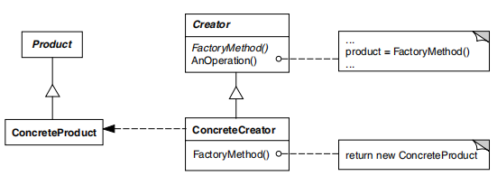

# 3.1.1. Factory Method

## Introdução
<!--
    A introdução deve apresentar o documento de forma clara e objetiva, fornecendo uma visão geral do conteúdo que será abordado.
    
    Perguntas a serem respondidas:

Este documento tem como objetivo apresentar o [tema ou objetivo].
O [tema ou objetivo] se refere a [definição ou descrição breve] [Nº Referência].
O [tema ou objetivo] é de extrema importância para [motivo], pois [justificativa].
Sendo assim, este documento tem como finalidade [objetivo do documento].
-->
Também conhecido como *Virtual Constructor*, o **Factory Method** é um padrão de [projeto criacional](PadroesDeProjeto/3.1.GoFsCriacionais) que fornece uma interface para criar objetos em uma superclasse, mas permite que as subclasses alterem o tipo de objetos que serão criados [1](#ref1).

A estrutura (ver na Figura 1) do Factory Method é composta por uma classe abstrata que declara o método de criação de objetos, que deve ser implementado por suas subclasses. O método de criação de objetos é uma fábrica que retorna objetos de um tipo específico. Dessa forma, o Factory Method permite que uma classe delegue a responsabilidade de instanciar objetos para suas subclasses [1](#ref1).

<font size="2"><p style="text-align: center">Figura 1 - Estrutura do Factory Method.</p></font>

<center>



</center>

<font size="2"><p style="text-align: center">Fonte: Gamma, E.; Helm, R.; Johnson, R.; Vlissides, J. GAMMA, E.; HELM, R.; JOHNSON, R.; VLISSIDES, J. Padrões de projeto: soluções reutilizáveis de software orientado a objetos [recurso eletrônico]. Tradução Luiz A. Meirelles Salgado. Porto Alegre: Bookman, 2007.</p></font>

O Factory Method oferece vantagens que o tornam uma escolha frequente em projetos orientados a objetos. Ele evita acoplamentos firmes entre o criador e os produtos, separando a lógica de criação do restante da aplicação. Isso segue o **Princípio de Responsabilidade Única**, centraliza o código de criação em um único local, facilitando alterações e manutenção. Além disso, respeita o **Princípio Aberto/Fechado**, permitindo a adição de novos tipos de produtos sem impactar o código cliente existente [2](#ref2).

Sendo assim, este documento tem como finalidade apresentar a aplicação do Factory Method no nosso projeto. Para isso, serão apresentados exemplos de código toy do Factory Method para a criação dos diferentes tipos de usuários e comentários.

## Metodologia
<!--
    A metodologia deve descrever o processo de elaboração do documento, apresentando as etapas e ferramentas utilizadas para a sua construção.
    
    Perguntas a serem respondidas:
f
Para a elaboração deste documento, foram seguidas as seguintes etapas:
- Inicialmente, foi realizada uma reunião com os membros da equipe do projeto [X] para discutir e alinhar as principais questões relacionadas a [tema ou objetivo].
- Pesquisas foram conduzidas em [A](#ref1) e [B](#ref2), proporcionando uma base sólida para a análise e discussão.
    - Se possível, adicionar algum algum documento nosso. (Caso haja elo com outro documento)
- O desenvolvimento do projeto seguiu a metodologia [C](#ref3), garantindo a aplicabilidade das melhores práticas no processo.
- Utilizou-se a ferramenta [Z](#ref4) para a parte [L] do projeto, a fim de [justificativa].

A metodologia [C] adotada pode ser visualizada de forma detalhada através dos seguintes passos [listar, tabela, imagens, ou vídeos, conforme necessário].
-->

## Desenvolvimento


<font size="2"><p style="text-align: center">Figura 1 - Diagrama Factory Method, User.</p></font>

<center>


</center>

<font size="2"><p style="text-align: center">Autor(es): [Kathlyn Murussi][KathlynGH] & [Pablo S. Costa][PabloGH], 2024.</p></font>

```ts
export class UserModule {
    @Module({
        imports: [
            MongooseModule.forFeature([{ name: User.name, schema: UserSchema }]),
        ],
        controllers: [UserController],
        providers: [UserService],
    })
}
```

```ts
export class HostModule extends UserModule {
    @Module({
        providers: [HostService]
    })
}
```

```ts
export class AdminModule extends UserModule {
    @Module({
        providers: [AdminService]
    })
}
```

```ts
/* Creator */
export class UserService {
    constructor(
        @InjectModel(User.name) private readonly userModel: Model<User>,
    ) {}

    public async create(createUserDto: CreateUserDto): Promise<User> {
        const createdUser = new this.userModel(createUserDto);
        return createdUser.save();
    }
    public login(): UserModel{
        return createdUser;
    }
}
```

```ts
export class HostService extends UserService{
    override constructor(
        @InjectModel(User.name) private readonly hostModel: Model<User>,
    ) {}
    public async override create(createUserDto: CreateUserDto): Promise<User> {
        const createdHost = new this.hostModel(createUserDto);
        return createdHost.save();
    }
}
```

```ts
export class AdminService extends UserService{
    override constructor(
        @InjectModel(User.name) private readonly adminModel: Model<User>,
    ) {}
     public async override create(createUserDto: CreateUserDto): Promise<User> {
        const createdAdmin = new this.adminModel(createUserDto);
        return createdAdmin.save();
    }
}
```

<font size="2"><p style="text-align: center">Figura 2 - Diagrama Factory Method, Comment.</p></font>

<center>


</center>

<font size="2"><p style="text-align: center">Autor(es): [Kathlyn Murussi][KathlynGH] & [Pablo S. Costa][PabloGH], 2024.</p></font>

```ts
export class CommentModule {
    @Module({
        imports: [
            MongooseModule.forFeature([{ id: Comment.id, schema: CommentSchema }]),
        ],
        controllers: [CommentController],
        providers: [CommentService],
    })
}
```

```ts
export class RateModule extends CommentModule {
    @Module({
        imports: [
            MongooseModule.forFeature([{ rate: Rate.id}]),
        ],
        providers: [RateService],
    })
}
```

```ts
export class CommentService {
    constructor(
        @InjectModel(Comment.id) private readonly commentModel: Model<Comment>,
    ) {}

    public async comentOnEvent(createCommentDto: CreateCommentDto): Promise<Comment> {
        const createdComment = new this.commentModel(CreateCommentDto);
        return createdComment.save();
    }
    public sendComment(): commentModel{
        return createdComment;
    }
}
```

```ts
export class RateService extends CommentService{
    constructor(
        @InjectModel(Rate.id) private readonly rateModel: Model<Rate>,
    ) {}

    public async commentOnEvent(CreateRateDto: CreateRateDto): Promise<Rate> {
        const createdRate = new this.rateModel(CreateRateDto);
        return createdRate.save();
    }
}
```
<!--
    Adicione aqui quantas subseções achar necessário para o desenvolvimento do documento.
-->

<!--
                                    TEMPLATE DE INSERÇÃO DE IMAGEM

<font size="2"><p style="text-align: center">Figura 1 - imagem.</p></font>

<center>


</center>

<font size="2"><p style="text-align: center">Autor(es): [Ciclano](CiclanoGH), 2001.</p></font>
(Se a imagem não for de autoria própria, trocar o autor para a fonte da imagem)
-->

<!--
                                    TEMPLATE DE INSERÇÃO DE TABELA
<font size="2"><p style="text-align: center">Tabela 1 - Tabela.</p></font>

<center>

| Um | Dois | Três |
| :--: | -- | -- |
| 1 | 2 | 3 |

</center>

<font size="2"><p style="text-align: center">Autor(es): [Ciclano](CiclanoGH), 2001.</p></font>
(Se a tabela não for de autoria própria, trocar o autor para a fonte na tabela)
-->

### Análise dos Resultados <!-- NÃO apague essa sub -->
<!-- 
    Utilize este espaço para destacar os principais achados, interpretar os dados e identificar implicações ou limitações dos resultados obtidos. Adicione observações objetivas e mantenha o foco na relevância dos resultados para o projeto. 
-->

## Gravação da Reunião 
<!--
    Apague essa seção se não tiver gravação(s) da reunião. Mas tenha em mente que é uma boa prática gravar as reuniões para futuras consultas.
-->

<font size="2"><p style="text-align: center">Vídeo 1 - Gravação da reunião 1 para iciciar o Factory Method</p></font>

<iframe width="560" height="315" 
  src="https://www.youtube.com/embed/nqYi5JgN9Vg" 
  frameborder="0" 
  allow="accelerometer; autoplay; clipboard-write; encrypted-media; gyroscope; picture-in-picture" 
  allowfullscreen>
</iframe>

<font size="2"><p style="text-align: center">Participantes: [Kathlyn Murussi][KathlynGH] & [Pablo S. Costa][PabloGH], 7 de dez. de 2024.</p></font>

## Bibliografia

> 1. <a id="ref2"></a> Gamma, E.; Helm, R.; Johnson, R.; Vlissides, J. GAMMA, E.; HELM, R.; JOHNSON, R.; VLISSIDES, J. Padrões de projeto: soluções reutilizáveis de software orientado a objetos [recurso eletrônico]. Tradução Luiz A. Meirelles Salgado. Porto Alegre: Bookman, 2007.
>
> 2. <a id="ref1"></a> Factory Method. Refactoring.Guru. Disponível em: [https://refactoring.guru/pt-br/design-patterns/factory-method](https://refactoring.guru/pt-br/design-patterns/factory-method). Acesso em: 08 de dez. de 2024.
>
> 3. <a id="ref3"></a>Titulo da fonte. Disponível em: [https://link.com](https://link.com). Acesso em: 01 de jan. de 2001.
>
> 4. <a id="ref4"></a>Titulo da fonte. Disponível em: [https://link.com](https://link.com). Acesso em: 01 de jan. de 2001.
>

## Histórico de Versões

| Versão | Data | Descrição | Autor(es) | Revisor(es) | Detalhes da revisão |
| :----: | :--: | --------- | ----------- | ------ | :---: |
| `1.0`  | 07/12/2024 | Criação do documento. | [Kathlyn Murussi][KathlynGH] & [Pablo S. Costa][PabloGH]  |  |  | 

[AnaGH]: https://github.com/analufernanndess
[CainaGH]: https://github.com/freitasc
[ClaudioGH]: https://github.com/claudiohsc
[EliasGH]: https://github.com/EliasOliver21
[GuilhermeGH]: https://github.com/gmeister18
[JoelGH]: https://github.com/JoelSRangel
[KathlynGH]: https://github.com/klmurussi
[PabloGH]: https://github.com/pabloheika
[PedroRGH]: https://github.com/pedro-rodiguero
[PedroPGH]: https://github.com/Pedrin0030
[SamuelGH]: https://github.com/samuelalvess
[TalesGH]: https://github.com/TalesRG
