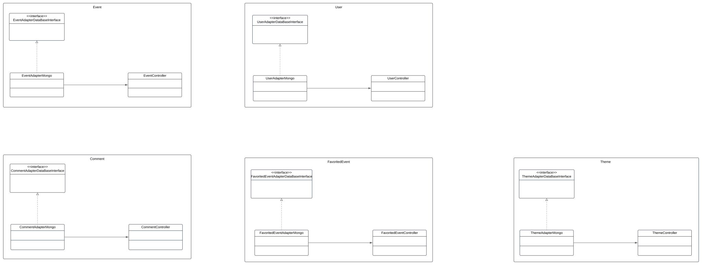

# 3.2.1.(Adapter)

## Introdução
Este documento tem como objetivo apresentar o **padrão de projeto estrutural Adapter**, pertencente à categoria dos padrões criacionais descritos no
livro *"Design Patterns: Elements of Reusable Object-Oriented Software"*, de Erich Gamma, Richard Helm, Ralph Johnson e John Vlissides
(conhecidos como Gang of Four, ou GoF) <sup><a href="#ref1">[1]</a></sup>.

O adapter atua como um intermediário que possibilita a colaboração entre objetos com interfaces incompatíveis.
Ele faz a correspondência entre diferentes interfaces, permitindo que essas classes trabalhem juntas sem a necessidade de alterar seus códigos originais<sup><a href="#ref2">[2]</a></sup>.

Além disso, são apresentadas duas variações do padrão:

1. Adapter de Classe: Utiliza herança para adaptar a interface de uma classe existente<sup><a href="#ref1">[1]</a></sup>.
2. Adapter de Objeto: Utiliza composição, delegando a funcionalidade para uma instância de outra classe<a href="#ref1"><sup>[1]</sup></a>.

Sendo assim, este documento tem como finalidade **explicar o conceito do padrão Adapter, descrever suas principais características, ilustrar suas aplicações práticas e apresentar diagramas UML** que facilitam a compreensão e a implementação deste padrão.


## Metodologia

Para a elaboração deste documento, foram seguidas as seguintes etapas:

**Início do Projeto:** Primeiramente, foi realizado um estudo nos slides postados na plataforma Aprender, com o material disponibilizado pela professora <sup><a href="#ref3">[3]</a></sup>, como base para o entendimento do conceito do padrão de projeto estrutural Adapter.

**Busca por Ferramenta:** Após a conclusão dos estudos iniciais, iniciou-se a busca por uma plataforma adequada para ilustrar o padrão Adapter na forma de diagrama UML, com a finalidade de melhor representar o conceito de maneira visual e clara. A plataforma escolhida para isso foi o Lucidchart.

No projeto Backend estamos utilizando a tecnologia NestJS, então o código e estrutura será baseado nesse framework.

## Desenvolvimento


Abaixo, na figura fornecida, temos a modelagem descrevendo a utilização do padrão Adapter para a integração de diferentes entidades com o banco de dados no nosso projeto. No diagrama, temos as interfaces EventAdapterDataBaseInterface, UserAdapterDataBaseInterface, CommentAdapterDataBaseInterface, FavoredEventAdapterDataBaseInterface e ThemeAdapterDataBaseInterface, que definem as assinaturas dos métodos necessários para a comunicação com o banco de dados.

Para cada uma dessas entidades, temos a implementação do adaptador correspondente, como EventAdapterMongo, UserAdapterMongo, CommentAdapterMongo, FavoritedEventAdapterMongo e ThemeAdapterMongo, que são responsáveis pela adaptação dos dados entre a aplicação e o MongoDB. Esses adaptadores implementam as interfaces mencionadas, garantindo que cada entidade siga o mesmo fluxo de comunicação com o banco de dados.

Além disso, cada entidade possui seu respectivo controlador, como EventController, UserController, CommentController, FavoritedEventController e ThemeController, que gerenciam as operações para essas entidades. Esses controladores orquestram as interações entre os adaptadores e o cliente, garantindo que as operações sejam executadas de maneira adequada.

Dessa forma, o padrão Adapter permite que o projeto integre diferentes entidades com o banco de dados de forma flexível, utilizando interfaces para garantir que cada adaptação de dados seja realizada de forma consistente e desacoplada.

<font size="2"><p style="text-align: center">Figura 1 - Adapter.</p></font>

<center>



</center>

<font size="2"><p style="text-align: center">Autor(es): [Ana Luíza Fernandes Alves da Rocha](AnaGH) e [Tales Rodrigues Gonçalves](TalesGH), 2025.</p></font>

Temos a implementação de três componentes principais – Interface, Adapter e Controller – utilizando o padrão Adapter para a criação e manipulação de objetos no nosso projeto. O padrão Adapter é utilizado para desacoplar a lógica de negócio da implementação da persistência de dados, permitindo que a aplicação seja mais flexível e fácil de manter.

### Interface

#### CommentAdapterDataBaseInterface

```ts
export interface CommentAdapterDataBaseInterface {
create(data: any): void;
}
```

#### EventAdapterDataBaseInterface

```ts
export interface EventAdapterDataBaseInterface {
    create(data: any): void;
}
```

#### FavoritedEventAdapterDataBaseInterface

```ts
export interface FavoritedEventAdapterDataBaseInterface {
    create(data: any): void;
}

```

#### ThemeAdapterDataBaseInterface

```ts
export interface ThemeAdapterDataBaseInterface {
    create(data: any): void;
}
```

#### UserAdapterDataBaseInterface

```ts
import { CreateUserDto } from '../dto/create-user.dto';

export interface UserAdapterDataBaseInterace {
    create(data: CreateUserDto): void;
}

```

### Adapter

#### CommentAdapterMongo

```ts
import { Injectable } from '@nestjs/common';
import { InjectModel } from '@nestjs/mongoose';
import { CommentAdapterDataBaseInterface } from '../interface/CommentAdapterDataBaseInterface';
import { Comment } from '../schema/comment.schema';
import { Model } from 'mongoose';

@Injectable()
export class CommentAdapterMongo implements CommentAdapterDataBaseInterface {
    constructor(
        @InjectModel(Comment.name) private readonly commentModel: Model<Comment>,
    ) {}

    async create(comment: any): Promise<Comment> {
        const createComment = new this.commentModel(comment);
        return createComment.save();
    }
}
```

#### EventAdapterMongo

```ts
import { Injectable } from '@nestjs/common';
import { InjectModel } from '@nestjs/mongoose';
import { Model } from 'mongoose';
import { Event } from '../schema/event.schema';
import { EventAdapterDataBaseInterface } from '../interface/EventAdapterDataBaseInterface';

@Injectable()
export class EventAdapterMongo implements EventAdapterDataBaseInterface {
    constructor(
        @InjectModel(Event.name) private readonly eventModel: Model<Event>,
    ) {}

    async create(event: any): Promise<Event> {
        const createdEvent = new this.eventModel(event);
        return createdEvent.save();
    }
}
```

#### FavoritedEventAdapterMongo

```ts
import { Injectable } from '@nestjs/common';
import { FavoritedEvents } from '../schema/favoritedEvents.schema';
import { FavoritedEventAdapterDataBaseInterface } from '../interface/FavoritedEventAdapterDataBaseInterface';
import { InjectModel } from '@nestjs/mongoose';
import { Model } from 'mongoose';

@Injectable()
export class FavoritedEventAdapterMongo
    implements FavoritedEventAdapterDataBaseInterface
{
    constructor(
        @InjectModel(FavoritedEvents.name)
        private readonly favoritedEventsModel: Model<FavoritedEvents>,
    ) {}

    async create(favoritedEvents: any): Promise<FavoritedEvents> {
        const createdFavoritedEvents = new this.favoritedEventsModel(
            favoritedEvents,
        );
        return createdFavoritedEvents.save();
    }
}
```

#### ThemeAdapterMongo

```ts
import { Injectable } from '@nestjs/common';
import { InjectModel } from '@nestjs/mongoose';
import { ThemeAdapterDataBaseInterface } from '../interface/ThemeAdapterDataBaseInterface';
import { Theme } from '../schema/theme.schema';
import { Model } from 'mongoose';

@Injectable()
export class ThemeAdapterMongo implements ThemeAdapterDataBaseInterface {
    constructor(
        @InjectModel(Theme.name) private readonly themeModel: Model<Theme>,
    ) {}

    async create(theme: any): Promise<Theme> {
        const createTheme = new this.themeModel(theme);
        return createTheme.save();
    }
}
```

#### UserAdapterMongo

```ts
import { Injectable } from '@nestjs/common';
import { Model } from 'mongoose';
import { CreateUserDto } from '../dto/create-user.dto';
import { InjectModel } from '@nestjs/mongoose';
import { User } from '../schema/user.schema';
import { UserAdapterDataBaseInterace } from '../interface/UserAdapterDataBaseInterace';

@Injectable()
export class UserAdapterMongo implements UserAdapterDataBaseInterace {
    constructor(
        @InjectModel(User.name) private readonly userModel: Model<User>,
    ) {}

    async create(createUserDto: CreateUserDto): Promise<User> {
        const createdCat = new this.userModel(createUserDto);
        return createdCat.save();
    }
}
```

### Controller

#### comment.controller

```ts
import { Body, Controller, Post } from '@nestjs/common';
import { FavoritedEventAdapterMongo } from '../adapter/FavoritedEventAdapterMongo';

@Controller('comment')
export class FavoritedEventsController {
    constructor(private readonly commentService: FavoritedEventAdapterMongo) {}

    @Post()
    async create(@Body() comment: any) {
        await this.commentService.create(comment);
    }
}
```

#### event.controller

```ts
import { Body, Controller, Post } from '@nestjs/common';
import { FavoritedEventAdapterMongo } from '../adapter/FavoritedEventAdapterMongo';

@Controller('favoritedEvets')
export class FavoritedEventsController {
    constructor(
        private readonly favoritedEventsService: FavoritedEventAdapterMongo,
    ) {}

    @Post()
    async create(@Body() favoritedEvets: any) {
        await this.favoritedEventsService.create(favoritedEvets);
    }
}
```

#### favoritedEvent.controller

```ts
import { Body, Controller, Post } from '@nestjs/common';
import { FavoritedEventAdapterMongo } from '../adapter/FavoritedEventAdapterMongo';

@Controller('favoritedEvets')
export class FavoritedEventsController {
    constructor(
        private readonly favoritedEventsService: FavoritedEventAdapterMongo,
    ) {}

    @Post()
    async create(@Body() favoritedEvets: any) {
        await this.favoritedEventsService.create(favoritedEvets);
    }
}
```

#### theme.controller

```ts
import { Body, Controller, Post } from '@nestjs/common';
import { ThemeAdapterMongo } from '../adapter/ThemeAdapterMongo';

@Controller('theme')
export class ThemeController {
    constructor(private readonly themeService: ThemeAdapterMongo) {}

    @Post()
    async create(@Body() theme: any) {
        await this.themeService.create(theme);
    }
}
```

#### user.controller

```ts
import { Body, Controller, Post } from '@nestjs/common';
import { CreateUserDto } from '../dto/create-user.dto';
import { UserAdapterMongo } from '../adapter/UserAdapterMongo';

@Controller('user')
export class UserController {
    constructor(private readonly userService: UserAdapterMongo) {}

    @Post()
    async create(@Body() createUserDto: CreateUserDto) {
        await this.userService.create(createUserDto);
    }
}
```

### Análise dos Resultados

A partir dos estudos conduzidos pela professora e das consultas realizadas no livro Use a Cabeça! Padrões de Projeto vimos a importância e o quanto agrega ao projeto utilizar os padrões estruturais como o Adapter, por exemplo, permitindo que classes com interfaces incompatíveis trabalhem juntas.

## Gravação da Reunião

<font size="2"><p style="text-align: center">Vídeo 1 - Gravação da reunião sobre o Adapter </p></font>

<iframe width="560" height="315" src="https://youtu.be/mUsVVgIJyLg" title="YouTube video player" frameborder="0" allow="accelerometer; autoplay; clipboard-write; encrypted-media; gyroscope; picture-in-picture; web-share" referrerpolicy="strict-origin-when-cross-origin" allowfullscreen></iframe>


<font size="2"><p style="text-align: center">Participantes: [Ana Luíza Fernandes Alves da Rocha](AnaGH) e [Tales Rodrigues Gonçalves](TalesGH), 04 de jan. de 2024.</p></font>

## Bibliografia

> 1. <a id="ref1"></a>Gamma, E., Helm, R., Johnson, R., & Vlissides, J. *Design Patterns: Elements of Reusable Object-Oriented Software*. Acesso em: 25 de dez. de 2024.
>
> 2. <a id="ref2"></a>Adapter. Disponível em: [https://refactoring.guru/pt-br/design-patterns/adapter](https://link.com). Acesso em: 25 de dez. de 2024.
>
> 3. <a id="ref3"></a> SERRANO, Milene. AULA - GOFS ESTRUTURAIS. Slides. Universidade de Brasília, 2024. Acessado em: 25 de dez. de 2024.
>
> 4. <a id="ref1"></a>Freeman, E., & Robson, E. Use a Cabeça: Padrões de Projeto. Acesso em: 04 de jan. de 2025.
>

## Histórico de Versões

| Versão  |    Data    | Descrição                               | Autor(es)                                                                          | Revisor(es) | Detalhes da revisão |
|:-------:|:----------:|-----------------------------------------|------------------------------------------------------------------------------------| ------ | :---: |
|  `1.0`  | 25/12/2024 | Criação do documento.                   | [Ana Luíza Fernandes Alves da Rocha](AnaGH) e [Tales Rodrigues Gonçalves](TalesGH) | [Ana Luíza Fernandes Alves da Rocha](AnaGH) |  Ajuste de ortografia e comentários. | 
|  `1.1`  | 25/12/2024 | Revisão ortográfica e gramatical.       | [Ana Luíza Fernandes Alves da Rocha](AnaGH)                                        | [Ana Luíza Fernandes Alves da Rocha](AnaGH) | Revisão ortográfica e gramatical. | 
|  `1.2`  | 04/01/2025 | Adicionando diagrama e código | [Ana Luíza Fernandes Alves da Rocha](AnaGH) e [Tales Rodrigues Gonçalves](TalesGH) |[Cláudio Henrique][ClaudioGH]|Foram encontrados e corrigidos somente erros gramaticais.|

[AnaGH]: https://github.com/analufernanndess
[CainaGH]: https://github.com/freitasc
[ClaudioGH]: https://github.com/claudiohsc
[EliasGH]: https://github.com/EliasOliver21
[GuilhermeGH]: https://github.com/gmeister18
[JoelGH]: https://github.com/JoelSRangel
[KathlynGH]: https://github.com/klmurussi
[PabloGH]: https://github.com/pabloheika
[PedroRGH]: https://github.com/pedro-rodiguero
[PedroPGH]: https://github.com/Pedrin0030
[SamuelGH]: https://github.com/samuelalvess
[TalesGH]: https://github.com/TalesRG
