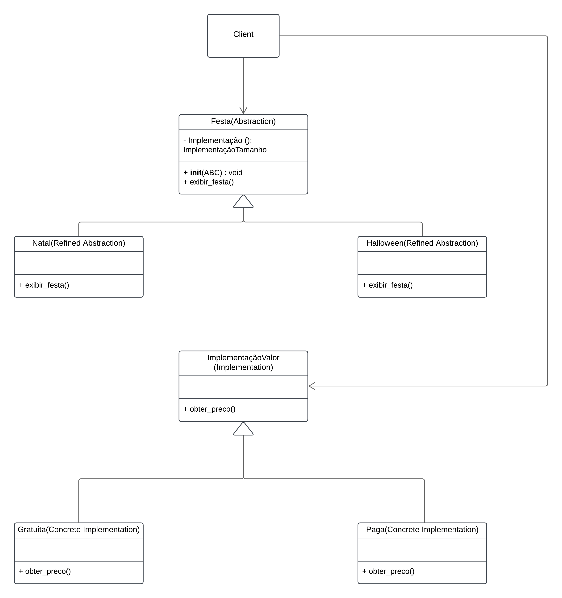

# 3.2.2.Bridge
<!--
    Lembrete de que isso é só um template. Apenas um guia para ajudar a lembrar de pontos importantes.
    Sinta-se livre para adicionar ou remover seções conforme a necessidade do documento. :)
-->

## Introdução

O Bridge é um padrão de projeto estrutural do catálogo do Gang of Four (GoF) que tem como objetivo desacoplar uma abstração de sua implementação, permitindo que ambas evoluam de forma independente. Esse padrão é particularmente útil em situações onde a abstração pode ter várias variações e, simultaneamente, suas implementações também podem variar. Ele promove maior flexibilidade ao código e evita a explosão de subclasses, um problema comum em sistemas que utilizam herança extensiva.

## Metodologia

A elaboração deste documento sobre o padrão Bridge começou com uma revisão teórica baseada no livro Design Patterns: Elements of Reusable Object-Oriented Software (GoF), complementada por pesquisas em fontes acadêmicas e documentações técnicas. A implementação foi desenvolvida em Java utilizando o IDE IntelliJ IDEA e seguiu o diagrama UML fornecido, garantindo a independência entre abstração e implementação. A ferramenta PlantUML foi utilizada para validar o modelo, enquanto testes automatizados com JUnit asseguraram a conformidade do código com os princípios do padrão. Por fim, o documento foi consolidado em Markdown, garantindo clareza e padronização.

## Desenvolvimento

### Diagrama UML

Aqui está um exemplo simples de implementação do padrão Bridge em Java no contexto do diagrama UML apresentado:

Primeiro, define-se uma interface para a implementação (Valor) e duas classes concretas que a implementam (Gratuita e Paga):


<h6 align = "center">Figura 1: Diagrama de classes Bridge</h6>

### Código
Aqui está um exemplo simples de implementação do padrão Adapter em Python no contexto do diagrama UML:

Primeiro é definido uma interface para a implementação (Tamanho) e duas classes concretas que a implementam (TamanhoPequeno e TamanhoGrande):

```JAVA
// Interface para a implementação
interface ImplementacaoValor {
    String obterPreco();
}

// Implementações concretas
class Gratuita implements ImplementacaoValor {
    @Override
    public String obterPreco() {
        return "Esta festa é gratuita.";
    }
}

class Paga implements ImplementacaoValor {
    @Override
    public String obterPreco() {
        return "Esta festa é paga.";
    }
}
```

Depois, é implementada uma classe abstrata para a abstração (Festa) e duas classes refinadas que a estendem (Natal e Halloween):

```JAVA
// Abstração
abstract class Festa {
    protected ImplementacaoValor implementacao;

    public Festa(ImplementacaoValor implementacao) {
        this.implementacao = implementacao;
    }

    public abstract void exibirFesta();
}

// Abstrações refinadas
class Natal extends Festa {
    public Natal(ImplementacaoValor implementacao) {
        super(implementacao);
    }

    @Override
    public void exibirFesta() {
        System.out.println("Festa de Natal: " + implementacao.obterPreco());
    }
}

class Halloween extends Festa {
    public Halloween(ImplementacaoValor implementacao) {
        super(implementacao);
    }

    @Override
    public void exibirFesta() {
        System.out.println("Festa de Halloween: " + implementacao.obterPreco());
    }
}

```
Após isso, cria-se uma função principal que instancia as diferentes variações de festas e implementações:

```JAVA
// Cliente
public class Main {
    public static void main(String[] args) {
        // Festa de Natal gratuita
        Festa natalGratuito = new Natal(new Gratuita());
        natalGratuito.exibirFesta();

        // Festa de Halloween paga
        Festa halloweenPago = new Halloween(new Paga());
        halloweenPago.exibirFesta();
    }
}

```

## Resultado
Após rodar o código acima vai imprimir o seguinte reultado:
```JAVA
Festa de Natal: Esta festa é gratuita.
Festa de Halloween: Esta festa é paga.
```

### Análise dos Resultados 

A implementação do padrão Bridge demonstrou, de forma prática, sua principal vantagem: a independência entre a abstração (Festa) e a implementação (Valor). Isso permitiu combinar diferentes tipos de festas (Natal, Halloween) com métodos distintos de precificação (Gratuita, Paga) sem necessidade de alterar as classes existentes.

## Bibliografia

> **Arquitetura e Desenho de Software - Aula GoFs Criacionais**. Material de apoio em slides. Milene Serrano.

> Gamma, Erich, et al. **Padrões de projetos: soluções reutilizáveis de software orientados a objetos.** Disponível em: Minha Biblioteca, Grupo A, 2000.

>REFATORING GURU. Singleton Design Pattern. Disponível em: https://refactoring.guru/pt-br/design-patterns/singleton. Acesso em: 21 Dez. 2024.

## Histórico de Versões

| Versão | Data | Descrição | Autor(es) | Revisor(es) | Detalhes da revisão |
| :----: | :--: | --------- | ----------- | ------ | :---: |
| `1.0`  | 23/12/2024 | Criação do documento. | [Guilherme](GuilhermeGH)  |  |  | 

[AnaGH]: https://github.com/analufernanndess
[CainaGH]: https://github.com/freitasc
[ClaudioGH]: https://github.com/claudiohsc
[EliasGH]: https://github.com/EliasOliver21
[GuilhermeGH]: https://github.com/gmeister18
[JoelGH]: https://github.com/JoelSRangel
[KathlynGH]: https://github.com/klmurussi
[PabloGH]: https://github.com/pabloheika
[PedroRGH]: https://github.com/pedro-rodiguero
[PedroPGH]: https://github.com/Pedrin0030
[SamuelGH]: https://github.com/samuelalvess
[TalesGH]: https://github.com/TalesRG